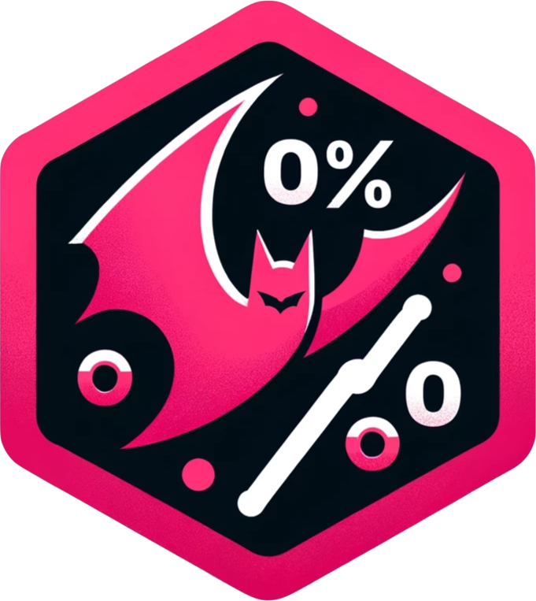

<!-- README.md is generated from README.Rmd. Please edit that file -->

# slap <a href="https://slap.tada.science"></a>

<!-- badges: start -->

[](https://lifecycle.r-lib.org/articles/stages.html#experimental)
[](https://CRAN.R-project.org/package=slap)
[](https://github.com/tadascience/slap/actions/workflows/R-CMD-check.yaml)
<!-- badges: end -->

The goal of slap is simplify error handling.

## Installation

``` r
pak::pak("tadascience/slap")
```

## Example

``` r
library(dplyr)
library(slap)

# suppose you have a function that throws an error
boom <- function() stop("An error occured in boom()")
# and you want to use it in e.g. dplyr::summarise()
# summarise(mtcars, mpg = boom())

# if you want to catch it and rethrow an error that is more
# meaningful to you, one way is to use withCallingHandlers()
withCallingHandlers(
  summarise(mtcars, mpg = boom()), 
  error = function(err) {
    cli::cli_abort("ouch", parent = err)
  }
)

# but that's kind of boring, so instead you can use the 
# slap operator %!% to slap away the eror
summarise(mtcars, mpg = boom()) %!% "ouch"

# or the double slap operator %!!% if you don't want to keep the parent error
summarise(mtcars, mpg = boom()) %!!% "ouch" 
```
